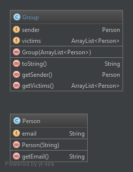

# Prankster
## Henrik Akesson

###Description
Prankster is a simple program that allows you to send forged emails to a list of addresses that you provide.
Groups of e-mail addresses are formed and one is picked at random to be the **sender**, and the rest are the **recipients**. The number of groups is user-defined, just like the smtp server to use and the email contents.

###Installation
It's simple! Just clone this repo, and head to the resources directory. In there you will find three files:
- **smtp.config**: This file is where you will define the smtp server to use, the port to use, the number of groups you want, the witness that will appear as "Cc" in the e-mails. Make sure there are no typos!

- **emailContents.txt**: This file will contain the e-mail contents to use. The format is the following:
	- Subject:'subject' is... the subject of the e-mail.
	- Underneath the subject you can write whatever you like. That will be the e-mail body content
	- '===' is used to separate the e-mail contents.
- **victims.txt**: This file is where you should write all the e-mail addresses that you wish to use in your prank.

Once you have filled in all these files, open a terminal and head to the project directory. Run the following command: "**java -jar Prankster.jar**" and you're good to go!

###Implementation
There are 5 class packages in this program:
- **parsers**: This package contains all the necessary parsers (email list, configuration, email contents)
- **people**: This package contains two classes: Person and Group. Groups are collections of Persons
- **mail**: This package has three classes: MainContent, Mail and MailCreator. MailCreators can return a list of e-mails from a list of Groups and a list of MailContents (that will be created through the mailContent file, i.e. a subject and a body). Mails are derived from MailContents and have additionnaly a list of recipients and a sender.
- **smtpclient**: Takes care of the communication with the server (sending mail). It opens a socket, sends the necessary strings to the server and closes the connection afterwards.
- **app**: Contains the main class, that will run the entire program.

####Class diagrams:
- **people**


- **parsers**


- **mail**


- **smtpclient**


- **app**


Here's the main lines: The app reads all the files in the resources directory, and proceeds to create Groups of victims. It then assigns an email content to each group, creates the Mails to be sent and sends them to the smtpclient class, which will in turn send them to the server.

###Not a prankster? not a problem!

You can run this program on a mock smtp server! You can download one right **[here](https://github.com/tweakers-dev/MockMock/blob/master/release/MockMock.jar?raw=true)**!

Run the jar file with the following command:
```JAVA
java -jar MockMock.jar -p 2525
```

You will then have a running smtp server, on which you can use Prankster2016! Just specify in your **smtp.config** file that the server is 'localhost' and the port is '2525'. You will then be using that local server and be able to see your prank e-mails!
